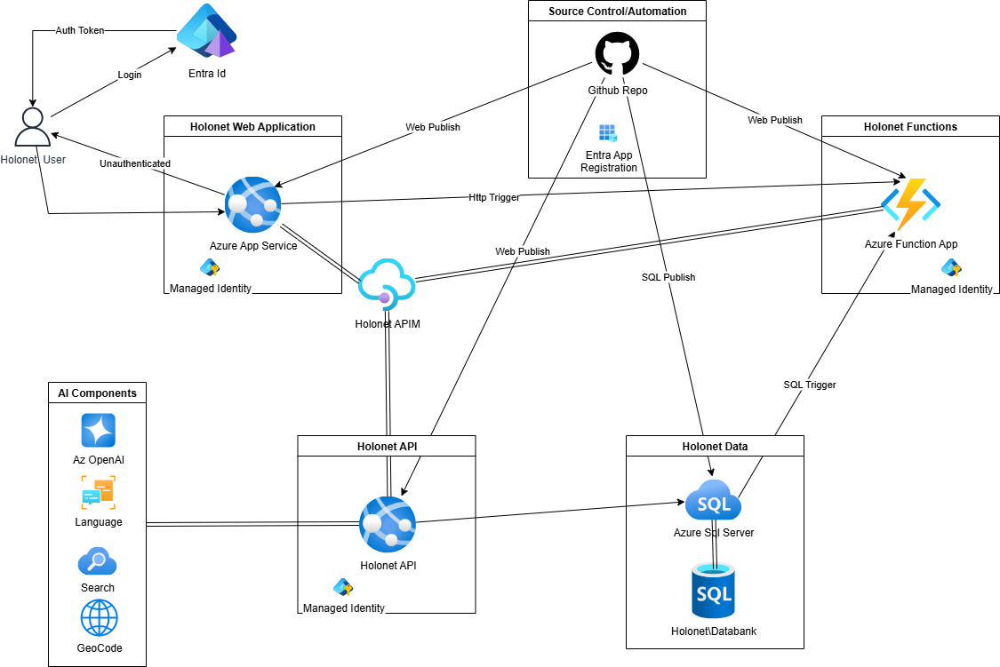

# Holonet.Databank

Holonet.Databank is a modular system designed to organize, store, and retrieve information for Star Wars-inspired holonet applications. The project aims to provide a flexible databank backend for holonet services, supporting structured data, rich metadata, and easy integration with front-end and API consumers.

## Project Components

- **Core**: Includes various model, entity, and DTO declarations used throughout the project components.
- **API**: RESTful endpoints for interfacing with data connections and external AI resources.
- **Application**: Dependency injection enablement and interface to the infrastructure objects.
- **DB**: DB porject outlining the various tables and procedures needed.
- **Infrastructure**: Data access classes, repositories, and Dapr implementations.
- **Web**: Blazor web front end to the databank

## Architecture Diagram

Below is an overview of the system architecture. For a detailed view, see the diagram in the `docs` directory.

## Contributing

Contributions are welcome! Please see the documentation for guidelines and submit pull requests for review.

## License

Distributed under the MIT License. See `LICENSE` for details.
